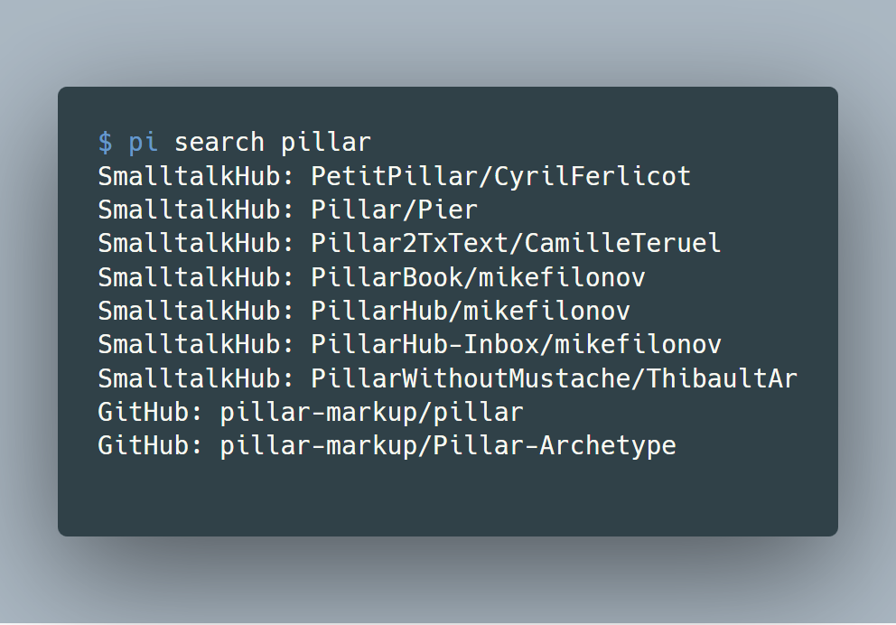

[](https://img.shields.io/badge/license-MIT-blue.svg)
[](http://makeapullrequest.com)
[](http://www.repostatus.org/#active)

# Description

Pharo Install - A tool for installing Pharo Smalltalk packages.

PI is a MIT-pip-like command line application installer for Pharo Smalltalk. Copy & pasting install scripts is an easy method, but it’s also time consuming because of the manual interaction. 

PI turns copy & paste Smalltalk (Metacello Configurations) install scripts into bash one-liners which works on Unix/Linux, MacOS and Windows (MinGW/MSYS). PI automatically tries to download necessary dependencies for parsing both SmalltalkHub and GitHub repositories lists, and also downloads the latest stable Pharo image and virtual machine if none is found in the current directory. It also supports installing multiple packages at once.

# Installation

curl users:
```bash
curl -O https://raw.githubusercontent.com/hernanmd/pi/master/pi
```

wget users:
```bash
wget --no-cache --no-check-certificate https://raw.githubusercontent.com/hernanmd/pi/master/pi
```

Copy the executable script to a location included in the PATH environment variable:

```bash
chmod 755 pi
mv pi /usr/local/bin
```

# Features

  - Listing packages supports GitHub and SmalltalkHub repositories. 
  - Installing packages is supported for: 
    - Metacello Configurations from Catalog (command line handler: get)
    - SmalltalkHub (command line handler: config)
  - It works with curl or wget.
  - Supports case-insensitive searching for package names or developer user name.

# Usage notes

  - The "image" option defaults to the current Pharo "stable" version. 
  - Assume only one image in a directory. Future version will add support for multiple images.
  - PI can query SmalltalkHub or GitHub. 
    - Listing packages from GitHub is currently (work in progress) limited to 100 results.
  - PI can install packages from SmalltalkHub (GitHub repositories is one the way).
  - Package search is case-sensitive.
  - For GitHub repositories: 
    - If it has "pharo" as topic, it will be listed.
    - If jq is not available, it will be downloaded to the directory where pi was executed.
  - For SmalltalkHub repositories: 
    - If xmllint is not available, it will be downloaded to the directory where pi was executed.  

# Usage examples

## Installing


## Listing


## Searching

Search both in SmalltalkHub and GitHub repositories:



# Sample outputs


# Contribute

**Working on your first Pull Request?** You can learn how from this *free* series [How to Contribute to an Open Source Project on 
GitHub](https://egghead.io/series/how-to-contribute-to-an-open-source-project-on-github)
    
If you have discovered a bug or have a feature suggestion, feel free to create an issue on Github.

If you'd like to make some changes yourself, see the following:    

  - Fork this repository to your own GitHub account and then clone it to your local device
  - Edit the pi file with your favorite text editor.
  - Test PI.    
  - Add <your GitHub username> to add yourself as author below.
  - Finally, submit a pull request with your changes!
  - This project follows the [all-contributors specification](https://github.com/kentcdodds/all-contributors). Contributions of any kind are welcome!

# ToDo

  - Timestamp output ?
  - Implement access to GitHub paginated results (https://developer.github.com/v3/guides/traversing-with-pagination/)
  - Implement GitHub package installation
  - Install individual packages instead of only Metacello Configurations.
  - Uninstall packages

# License

This software is licensed under the MIT License.

Copyright Hernán Morales, 2018.

Permission is hereby granted, free of charge, to any person obtaining a copy of this software and associated documentation files (the "Software"), to deal in the Software without restriction, including without limitation the rights to use, copy, modify, merge, publish, distribute, sublicense, and/or sell copies of the Software, and to permit persons to whom the Software is furnished to do so, subject to the following conditions:

The above copyright notice and this permission notice shall be included in all copies or substantial portions of the Software.

THE SOFTWARE IS PROVIDED "AS IS", WITHOUT WARRANTY OF ANY KIND, EXPRESS OR IMPLIED, INCLUDING BUT NOT LIMITED TO THE WARRANTIES OF MERCHANTABILITY, FITNESS FOR A PARTICULAR PURPOSE AND NONINFRINGEMENT. IN NO EVENT SHALL THE AUTHORS OR COPYRIGHT HOLDERS BE LIABLE FOR ANY CLAIM, DAMAGES OR OTHER LIABILITY, WHETHER IN AN ACTION OF CONTRACT, TORT OR OTHERWISE, ARISING FROM, OUT OF OR IN CONNECTION WITH THE SOFTWARE OR THE USE OR OTHER DEALINGS IN THE SOFTWARE.
